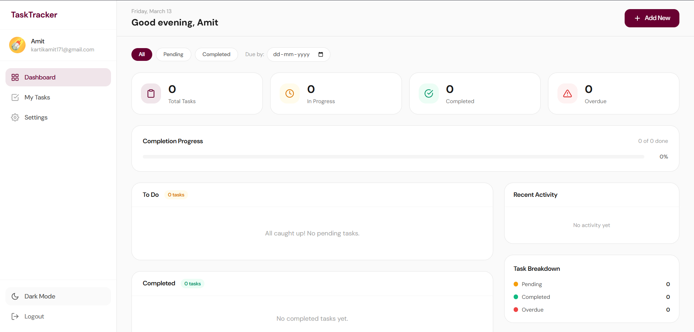
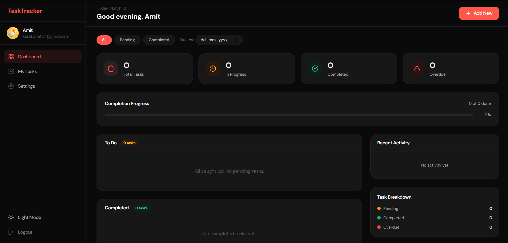
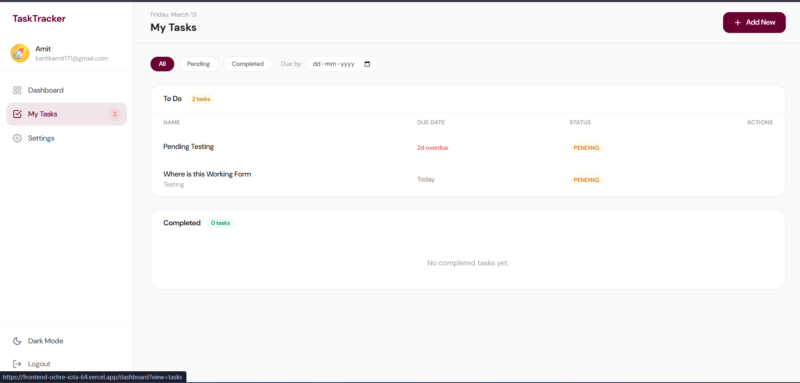
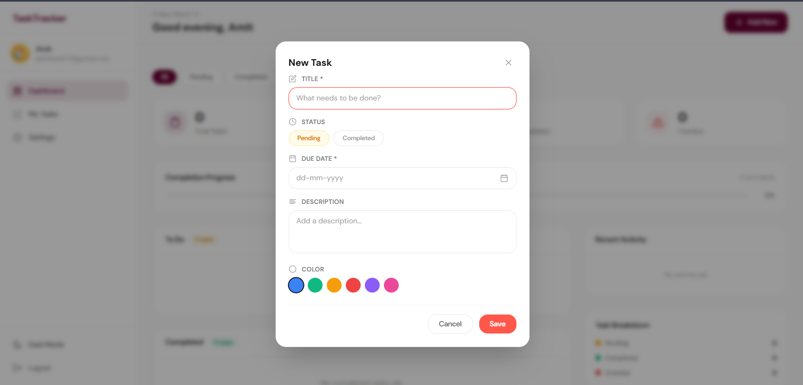
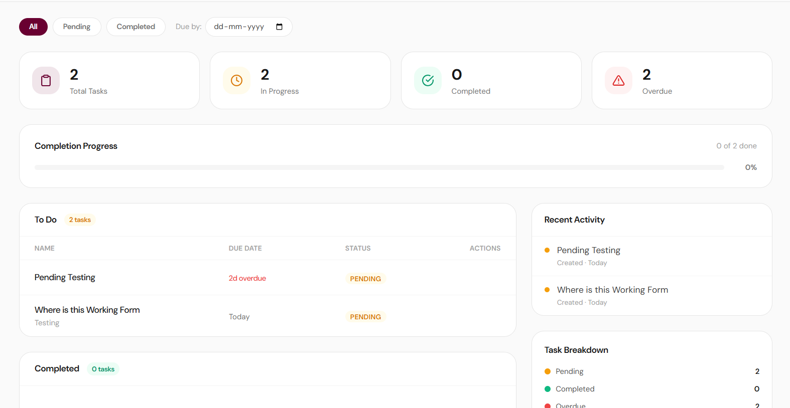
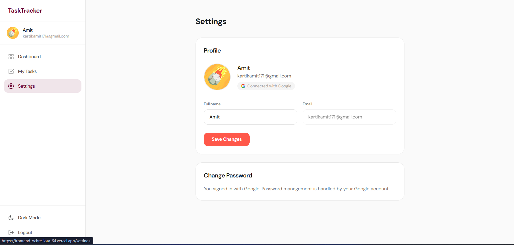

# Task Tracker

Full-stack task management application with JWT authentication, Redis caching, and a responsive Next.js frontend.

**Live Demo:** [https://frontend-ochre-iota-64.vercel.app](https://frontend-ochre-iota-64.vercel.app)
**Backend API:** [https://wldd-assignment.onrender.com/api](https://wldd-assignment.onrender.com/api)

---

## Tech Stack

| Layer | Technology |
|-------|-----------|
| Frontend | Next.js, React, TypeScript, Tailwind CSS |
| Backend | Node.js, Express, TypeScript |
| Database | MongoDB (Mongoose) |
| Caching | Redis (ioredis) |
| Auth | JWT (access + refresh tokens), Google OAuth (Firebase) |
| Testing | Jest, Supertest, mongodb-memory-server, ioredis-mock |
| Deployment | Vercel (Frontend), Render (Backend) |

## Features

- User signup/login with JWT and Google Sign-In
- Task CRUD with status filtering and due date sorting
- Redis caching with automatic invalidation on mutations
- Responsive UI with dark/light mode support
- Password reset flow

## Screenshots

### Dashboard — Light Mode


### Dashboard — Dark Mode


### My Tasks


### Add New Task


### Task Detail View


### Settings


---

## Local Setup

### Prerequisites
- Node.js (v18+)
- MongoDB (local or Atlas)
- Redis (local or cloud)

### Backend

```bash
cd backend
npm install
cp .env.example .env   # Fill in your values
npm run dev             # Starts on port 5000
```

### Frontend

```bash
cd frontend
npm install
```

Create `frontend/.env.local`:
```env
NEXT_PUBLIC_API_URL=http://localhost:5000/api
NEXT_PUBLIC_FIREBASE_API_KEY=your_key
NEXT_PUBLIC_FIREBASE_AUTH_DOMAIN=your_project.firebaseapp.com
NEXT_PUBLIC_FIREBASE_PROJECT_ID=your_project_id
```

```bash
npm run dev             # Starts on port 3000
```

## Environment Variables

### Backend (`backend/.env`)
| Variable | Description |
|----------|-------------|
| `PORT` | Server port (default: 5000) |
| `MONGODB_URI` | MongoDB connection string |
| `JWT_SECRET` | Secret key for access tokens |
| `JWT_REFRESH_SECRET` | Secret key for refresh tokens |
| `REDIS_HOST` | Redis host |
| `REDIS_PORT` | Redis port |
| `REDIS_PASSWORD` | Redis password (if any) |
| `FRONTEND_URL` | Allowed CORS origin |
| `FIREBASE_PROJECT_ID` | Firebase project ID for Google auth |

### Frontend (`frontend/.env.local`)
| Variable | Description |
|----------|-------------|
| `NEXT_PUBLIC_API_URL` | Backend API URL |
| `NEXT_PUBLIC_FIREBASE_*` | Firebase config for Google Sign-In |

## Testing

```bash
cd backend && npm test              # Run all tests (70 tests)
cd backend && npm run test:coverage # Coverage report
```

Tests use **mongodb-memory-server** and **ioredis-mock** — no external services needed.

## API Endpoints

### Auth (`/api/auth`)
| Method | Endpoint | Description |
|--------|----------|-------------|
| POST | `/signup` | Create new user |
| POST | `/login` | Authenticate user (JWT) |
| GET | `/me` | Get current user |
| GET | `/refresh` | Refresh access token |
| POST | `/logout` | Clear refresh token cookie |
| POST | `/google` | Google OAuth login |
| POST | `/forgot-password` | Send password reset email |
| POST | `/reset-password` | Reset password with token |

### Tasks (`/api/tasks`)
| Method | Endpoint | Description |
|--------|----------|-------------|
| GET | `/` | List tasks (cached per user, filterable by `status` & `dueDate`) |
| POST | `/` | Create a new task |
| PUT | `/:id` | Update a task |
| DELETE | `/:id` | Delete a task |

> All task endpoints require JWT authentication. Cache is invalidated on create, update, and delete.

---

## Deployment

### Backend → Render

1. Push your code to GitHub
2. Go to [Render Dashboard](https://dashboard.render.com) → **New Web Service**
3. Connect your GitHub repo and select the `master` branch
4. Configure:
   - **Root Directory:** `backend`
   - **Build Command:** `npm install && npm run build`
   - **Start Command:** `node dist/server.js`
5. Add all environment variables from `backend/.env.example` under **Environment**:
   - `MONGODB_URI` → your MongoDB Atlas connection string
   - `JWT_SECRET`, `JWT_REFRESH_SECRET` → strong random strings
   - `REDIS_HOST`, `REDIS_PORT`, `REDIS_PASSWORD` → your Redis cloud credentials
   - `FRONTEND_URL` → your Vercel frontend URL (e.g. `https://your-app.vercel.app`)
   - `FIREBASE_PROJECT_ID` → your Firebase project ID
6. Click **Deploy** — Render will build and start the service
7. Note the service URL (e.g. `https://your-app.onrender.com`)

### Frontend → Vercel

1. Go to [Vercel Dashboard](https://vercel.com/dashboard) → **Add New Project**
2. Import your GitHub repo
3. Configure:
   - **Root Directory:** `frontend`
   - **Framework Preset:** Next.js (auto-detected)
4. Add environment variables:
   - `NEXT_PUBLIC_API_URL` → your Render backend URL + `/api` (e.g. `https://your-app.onrender.com/api`)
   - `NEXT_PUBLIC_FIREBASE_API_KEY` → Firebase API key
   - `NEXT_PUBLIC_FIREBASE_AUTH_DOMAIN` → Firebase auth domain
   - `NEXT_PUBLIC_FIREBASE_PROJECT_ID` → Firebase project ID
5. Click **Deploy**

### Post-Deployment Checklist

- [ ] Update `FRONTEND_URL` on Render to match your Vercel production URL
- [ ] Add your Vercel domain to **Firebase Console → Authentication → Authorized Domains**
- [ ] Verify Google Login works on the live site
- [ ] Verify API health: `GET https://your-app.onrender.com/api/health`
